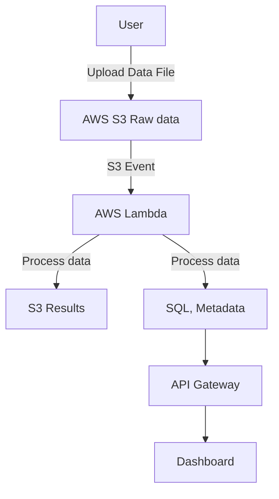

```mermaid

flowchart TD
    A["User"] 
    B["AWS S3 Raw data"]
    C["AWS Lambda"]
    D["S3 Results"]
    E["SQL, Metadata"]
    F["API Gateway"]
    G["Dashboard"]

    A -->|"Upload Data File"| B
    B -->|"S3 Event"| C
    C --> |"Process data"|D
    C --> |"Process data"|E
    E --> F
    F --> G
```